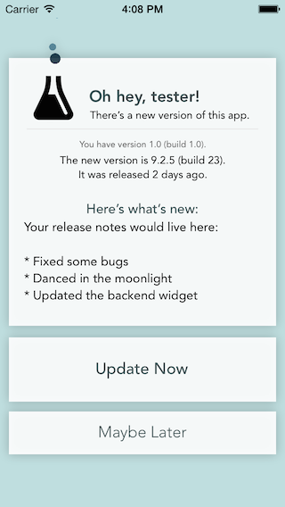
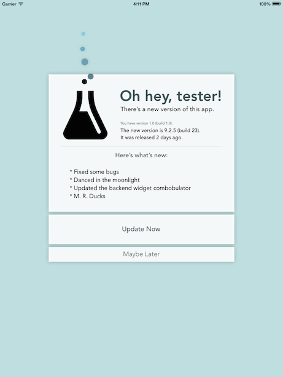

#  Aperitif [](https://travis-ci.org/crushlovely/Aperitif)

<!--
[](http://cocoadocs.org/docsets/Aperitif)
[](http://cocoadocs.org/docsets/Aperitif)
-->

An update checker for the wonderful [Installr](https://installr-app.com).

Inform your beta testers that there's a new version of your app to install, and do it all pretty-like. It requires iOS 7, and is available via CocoaPods.

It requires very little work to integrate, and it comes with a [swanky UI](#screenshots). The goal is for Aperitif to be a drop-in-and-forget-about-it solution.

## Usage
Aperitif provides a very simple API to check for updates. The recommended integration is something like this in your app delegate:

```objective-c
#import <Aperitif/CRLAperitif.h>

...

-(void)applicationDidBecomeActive:(UIApplication *)application
{
    #if CONFIGURATION_ADHOC
    [CRLAperitif sharedInstance].appToken = @"<Your App Token Here>";
    [[CRLAperitif sharedInstance] checkAfterDelay:3.0];
    #endif
}
```

That's it! Aperitif handles the rest. You can find your app token on the Settings tab for your app in Installr's dashboard.

The 3 second delay is intended to make let the application get through its own initialization before running the update check. Adjust the delay as needed, or perhaps move the code elsewhere, if it better suits your needs. `-checkNow` is the no-delay version of `-checkAfterDelay:`.

Make sure to only run this code in ad hoc builds. The easiest way to do that is probably to define a preprocessor variable in that configuration. See the [guide in CocoaLumberjack's wiki](https://github.com/CocoaLumberjack/CocoaLumberjack/wiki/XcodeTricks#details) for one way to do that.

## Installation
Aperitif is available through [CocoaPods](http://cocoapods.org), Until an official spec is merged, you can use it by adding the following line to your Podfile:

    pod 'Aperitif', :git => 'https://github.com/crushlovely/Aperitif.git'

## Screenshots
 

## Nitty-Gritty
In order to detect new versions of your app, **make sure to increment the version number or build number of your app between releases**. Apertif only knows how to compare version numbers that are period-separated numbers. For instance, 1.10.1 > 1.10 > 1.2 > 1.1 > 1. If you suffix your version numbers or build numbers with letters, or use some other version numbering system entirely, Aperitif won't work for you out of the box. Pull requests are welcome!

All errors (networking, API, or programmer) are logged to the console and otherwise ignored. Aperitif should (hopefully) never bring down your app or present an error message to the user.

Aperitif imposes a rate limit of one check every 10 minutes, at most. If you use the app delegate integration recommended above, a check will happen on every launch/open of the app, subject to that rate limit.

The `-check` methods do nothing if the app is not active (i.e. if `[UIApplication sharedApplication].applicationState` is not `UIApplicationStateActive`). This prevents spurious checks if your app is awoken for background processing.

`-checkAfterDelay:` will run its check on the low-priority dispatch queue, to avoid any UI hiccups.

An iPad and iPhone interface (both 3.5" and 4") are included. The iPhone interface is portrait-only, but that should hopefully have no impact on your app.

If the user hits "Maybe Later" on the modal, they are not prompted to install that build ever again. There is no option to "force" a user to upgrade.

## License
Aperitif is available under the MIT license. See the LICENSE file for more info.

## Acknowledgements
The [lovely icon](http://thenounproject.com/term/tulip-glass/30573/) above was designed by Erin Standley from The Noun Project. It is licensed under the Creative Commons Attribution License 3.0.

The bubbly flask in the update modal is from [iconmonstr](http://iconmonstr.com/flask-7-icon/).

[MZFormSheetController](https://github.com/m1entus/MZFormSheetController) powers the pretty blurry modal.

[PaintCode](http://www.paintcodeapp.com/) and [Particle Playground](http://www.vigorouscoding.com/mac-apps/particle-playground/) were indispensible in making things super pretty.

And, of course, thanks to [Installr](https://installrapp.com) for their wonderful product and amazing customer service.
